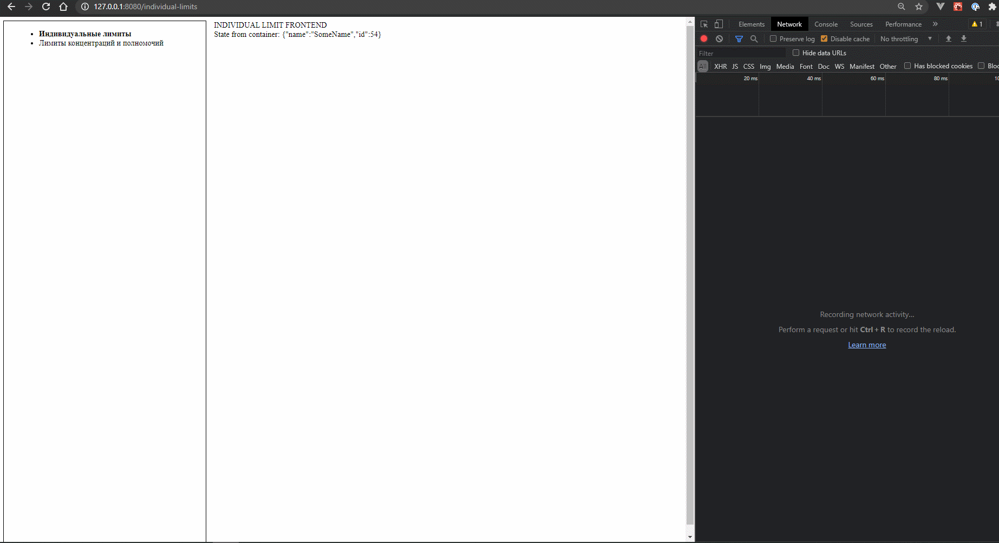

# Module Federation draft

Для запуска микрофронтендов необходимо выполнить следующие команды:

/container/ - npm install  
/individual-limit/ - npm install  
/concentration-limit/ - npm install  

/container/ - npm run start  
/individual-limit/ - npm run start  
/concentration-limit/ - npm run start  

После чего контейнер будет доступен по адресу http://127.0.0.1:8080/

